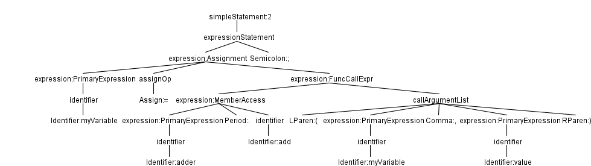

# Zellic Solidity Parser (solp)

### Description

Solp is a Python library used for reading, parsing and analysis Solidity source projects and contracts without having
to use the `solc` compiler. This is done by having different grammars for different versions of Solidity, transforming
them into a common AST and then further refining that AST into more specialised forms of IR for analysis. The resulting
ASTs and IRs are easily usable by consumer applications without any additional dependencies.

### Goals

The goal of this project are to:
  - parse Solidity source files into typed AST/IR structures
  - load code from different Solidity versions(0.4-0.8^) for common analyses
  - load entire Solidity projects for analysis with the requisite dependency context
  - enable and provide a language server and IDE support
  - be usable by developers and auditors in an IDE scripting context to generate insights for security analysis


### Status

Currently it is used in the Audit Signoff Injector where it's used for signoff comment generation and function call
analysis.

  - AST1 parsing for Solidity 0.4+ - done
  - AST1 -> AST2 refinement - done
  - AST2 -> TAC-SSA-IR - in progress
  - Integration and unit tests - partially implemented
  - Language server


### Project Structure
  - example/ - Demo/example code for understanding the API
  - src/solidity_parser
    - filesys.py - Solidity project environment management
      - VirtualFileSystem: file system environment manager in solp(and solc), resolves imports and loads files
      - LoadedSource: loaded source unit(file)
    - errors.py - Parsing/Compiler errors
    - util/version_util.py - Compiler/parser version helper
    - grammar/ - Solidity antlr grammars and generated lexers/parsers
    - ast/parsers/ - Antlr to AST1 parsers
    - ast - Main SOLP analysis/parsing package
      - symtab.py: AST1 symbol table builder
      - nodebase.py: AST1 and AST2 shared base code
      - types.py: AST1 and AST2 shared type system
      - solnodes.py: AST1 only tree nodes
      - solnodes2.py: AST2 only tree nodes
      - ast2builder.py: translates an AST1 parse tree into AST2
  - test/solidity_parser - SOLP unit + integration tests
  - testcases - Solidity data used in above tests
  - vendor - external dependencies
    - antlr-4.11.1-complete.jar: antlr for generating lexers/parsers 
  - setup.py - real setup script for the module
  - setup.sh - legacy helper script for generating ANTLR developer bindings
### Requirements

  - Python 3.11+ is required
  - Java 8+ (for antlr grammar stub generation)

### Setup

`setup.py` generates the antlr Python grammar stubs, builds and installs solp as `solidity-parser` with `pip install .`

For development setup install with `pip install -e .`


### Usage

Solp is not a standalone application so has no entry point to speak of. Example snippets and currently run
configurations for development are in `example/` but these aren't application usecases themselves.

The example code in `example/quickstart.py` enables you to load in a Solidity project and generate AST2 parse trees. 
These can then be used for analysis.


### How it works

The idea is to get AST2 parse trees. ANTLR and AST1 parse trees don't contain enough information in the nodes to be
useful on their own(e.g. imports, using statements, function calls, and more don't get resolved). To build AST2 parse
trees you take AST1 parse trees, generate symbol information and then pass both into the AST2 builder. This gives you
"linked" AST2 nodes, i.e. relationship program information is embedded into the nodes themselves.

For example, with the ANTLR grammar for 0.8.22 a library call such as `myVariable = adder.add(myVariable, value);` (line
11 in the `example/librarycall/TestContract.sol` file) would have the following parse tree



In AST1 this would parsed as:
```
ExprStmt(
    expr=BinaryOp(
        left=Ident(text='myVariable'),
        right=CallFunction(
            callee=GetMember(
                obj_base=Ident(text='adder'),
                name=Ident(text='add')
            ),
            modifiers=[],
            args=[Ident(text='myVariable'), Ident(text='value')]
        ),
        op=<BinaryOpCode.ASSIGN: '='>
    )
)
```

There are many things left to be desired but here are some the most obvious:
1. The store operation is a BinaryOp instead of a state variable store
2. The `callee` for the library call is a `GetMember` consisting of `Idents` only. Without the import
information in the current scope, we can't resolve this call.
3. Similarly, the arguments are `Idents` and represent state variable lookup and local variable lookup respectively. We
can't poll any information from this parse tree on its own because these Idents aren't bound to anything.

Here is the AST2 output of the same code:

```
StateVarStore(
        base=SelfObject(),
        name=Ident(text='myVariable'),
        value=FunctionCall(
            named_args=[],
            args=[
                StateVarLoad(base=SelfObject(), name=Ident(text='myVariable')),
                LocalVarLoad(
                    var=Var(
                        name=Ident(text='value'),
                        ttype=IntType(is_signed=False, size=256),
                        location=None
                    )
                )
            ],
            base=StateVarLoad(base=SelfObject(), name=Ident(text='adder')),
            name=Ident(text='add')
        )
)
```

The tree is much clearer and explicit in the operations performed. Additional functionality is also available due to the
linking, for example, calling `FunctionCall.resolve_call()` gives us the corresponding `FunctionDefinition` in the
`AdderLib.Adder` library, `base.type_of()` gives us a `ResolvedUserType(MyContract)` which can then be explored like in
the quickstart.py example.
