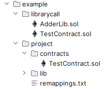

Quick Start
===========

Welcome to the SOLP docs! This guide will give you a rundown of how to load, parse, analyze, and manipulate your Solidity
code using SOLP.

Before starting, make sure you've installed the SOLP library by following :doc:`clients`.

Toy Project
-----------

This tutorial uses the ``example/project`` Solidity project provided in the SOLP repository. It includes examples of
`imports <https://docs.soliditylang.org/en/latest/path-resolution.html#imports>`_ and
`solc remappings <https://docs.soliditylang.org/en/latest/path-resolution.html#import-remapping>`_ as well regular Solidity code.

Here is the contract we'll be parsing. As you can see, it defines contract TestContract, which inherits from Ownable;
uses the inherited ``onlyOwner`` modifier; and does some simple function calls:

.. code-block:: solidity
   :caption: TestContract.sol

   // SPDX-License-Identifier: UNLICENSED
   pragma solidity ^0.8.0;

   import "@openzeppelin/access/Ownable.sol";

   contract MyContract is Ownable {
       uint256 public myVariable;

       function setMyVariable(uint256 newValue) public onlyOwner {
           myVariable = newValue;
       }

       function getMyVariable() public view returns (uint256) {
           return myVariable;
       }

       function addToVariable(uint256 value) public onlyOwner {
           myVariable += value;
       }

       function addToVariable2(uint256 value) public onlyOwner {
           myVariable += value;
       }

       function addPositive(uint256 value) public onlyOwner {
           require(value > 0);
           this.addToVariable2(value);
       }
   }

The ``example/librarycall`` project has an example of the
`using directive <https://docs.soliditylang.org/en/v0.8.25/contracts.html#using-for>`_ and will be used later on in this
tutorial.

Copy the ``example`` folder to somewhere on your machine — ``example/project`` will be the **project directory** from now
on.

Creating a Virtual File System (VFS)
------------------------------------

For SOLP to understand the code in the example project, it has to know where the source files, library files, and import
remappings are located and how the project is structured.

The :py:class:`solidity_parser.filesys.VirtualFileSystem` object takes these options, handles path mappings, reads
the files, and generates an unrefined AST.

.. code-block:: python
   :linenos:

   from solidity_parser import filesys

   project_dir = Path('./project')

   vfs = filesys.VirtualFileSystem(
       project_dir,
       None,
       [project_dir / 'contracts', project_dir / 'lib'],
       None
   )

Replace ``./project`` on line 3 with your **project directory**.

Now give the VFS the remapping file.

.. code-block:: python

   remappings_file = project_dir / 'remappings.txt'
   if remappings_file.exists():
       vfs.parse_import_remappings(remappings_file)

Getting AST1 Nodes
------------------

Remember how we mentioned that the VFS gives us an unrefined AST? This form of AST is known as **AST1**, and the VFS can
give us this very easily. We can then, for example, get the header information for MyContract in TestContract.sol.

.. code-block:: python

   from solidity_parser.ast import solnodes

   loaded_src = vfs.process_cli_input_file('project/contracts/TestContract.sol')
   ast_nodes = loaded_src.ast

   my_contract = [c for c in ast_nodes if isinstance(c, solnodes.ContractDefinition)][0]

   print(my_contract.name)
   print(my_contract.inherits[0].name)

While this might be useful, there are two limitations here:

# We can't get a reference to the ``ContractDefinition`` for Ownable (the inherited contract). In other words, we only know its name at this point but not where it comes from or what it contains.
# We have to load each source file one at a time instead of letting SOLP discover its way through the project.

Getting AST2 Nodes
------------------

To resolve the first issue above, we're going to get a more advanced version of the AST called **AST2**. The
:py:class:`SymtabBuilder <solidity_parser.ast.symtab.Builder2>` and :py:class:`AST2Builder <solidity_parser.ast.ast2builder.Builder>`
classes make this super simple!

.. code-block:: python
   :linenos:

   from solidity_parser.ast import symtab, ast2builder

   sym_builder = symtab.Builder2(vfs)
   file_sym_info = sym_builder.process_or_find_from_base_dir('TestContract.sol')

   ast2_builder = ast2builder.Builder()
   ast2_builder.enqueue_files([file_sym_info])

   ast2_builder.process_all()

In this example, we only loaded the entry point (TestContract.sol), but during symbol-table building, the Ownable.sol
file was also parsed. This makes it available later for AST2 building.

Now get the AST2 nodes using :py:meth:`Builder.get_top_level_units <solidity_parser.ast.ast2builder.Builder.get_top_level_units>`. This includes the Ownable and MyContract contracts, but to demonstrate the tree searching behavior, we'll use
MyContract only.

.. code-block:: python

   from solidity_parser.ast import solnodes2

   my_contract: solnodes2.ContractDefinition = [u for u in ast2_builder.get_top_level_units() if str(u.name) == 'MyContract'][0]
   ownable_type: solnodes2.ResolvedUserType = my_contract.inherits[0].name
   ownable_contract: solnodes2.ContractDefinition = ownable_type.value.x

.. note:: These AST2 objects come from the :py:mod:`solidity_parser.ast.solnodes2` module instead of the AST1 :py:mod:`solidity_parser.ast.solnodes` module.

Analyzing the AST
-----------------

Let's now collect the functions defined by Ownable and compute a measure of complexity based on the number of calls
it makes. This could be part of a tool to generate code insights or highlight areas that look overly complicated and
need to be refactored.

.. code-block:: python
   :linenos:

   ownable_functions = [p for p in ownable_contract.parts if isinstance(p, solnodes2.FunctionDefinition)]

   for f in ownable_functions:
       if not f.code:
           continue

       all_calls = f.code.get_all_children(lambda c: isinstance(c, solnodes2.Call))
       complexity = len(list(all_calls))

       print(f'{f.descriptor()} has complexity {complexity}')

The benefits of using an AST structure mean we can search through the entire code of each function easily and extract
the data we want.

Working With Nodes
------------------

SOLP lists the :py:mod:`AST1 <solidity_parser.ast.solnodes>` and :py:mod:`AST2 <solidity_parser.ast.solnodes2>` node
definitions as Python dataclasses and provides convenience features to make the objects easier to work with. Some common
ones are the following.

Parenting
^^^^^^^^^

All nodes have a ``parent`` attribute that points to the logical parent of the node (i.e., where it's declared in the
Solidity source code). The exact type of the parent differs depending on the node. For example,

* A ``FunctionDefinition`` can have a Contract, Interface, Library, or FileDefinition parent depending on where it was declared
* An ``Expr`` can have a parent that is another ``Expr`` or a ``Stmt``.

Equality by Value
^^^^^^^^^^^^^^^^^

Despite storing location and parent information, two nodes representing the same data can be compared using the ``==`` operator,
even when they are in different places in the AST. Here is a simple analysis that checks for functions that contain
duplicated code. See how we can check that the two functions are different (i.e., have a different names and signatures)
but also check the ``code`` nodes in an intuitive way.

.. code-block:: python

   import itertools

   for f1, f2 in itertools.combinations(funcs, r=2):
       if f1 != f2 and f1.code == f2.code:
           print(f'{f1.descriptor()} == {f2.descriptor()}')

Quick Consistent Hashes
^^^^^^^^^^^^^^^^^^^^^^^

Often we want to use nodes as keys in dicts, so we need a hash function. Python dataclasses don't support this for
definitions with mutable attributes or lists but SOLP does. Let's find which variables are set by which functions.

.. code-block:: python

   def count_var_uses(functions: list[solnodes2.FunctionDefinition]):
       var_stores = defaultdict(list)
       for func in functions:
           for store in func.code.get_all_children(lambda c: isinstance(c, solnodes2.StateVarStore)):
               var_stores[store.state_var()].append(func)
       return var_stores

This operation is also surprisingly fast as the ``state_var`` hash is cached until it's modified! This pattern is very
useful for creating call graphs (e.g., mappings of the type ``FunctionDefinition -> list[FunctionDefinitions]``).

Deep Copy
^^^^^^^^^

Entire node trees can be passed to :py:func:`copy.deepcopy` to produce a full identical tree.

.. code-block:: python

   from copy import deepcopy
   type2 = deepcopy(ownable_type)

   assert type2 == ownable_type
   assert hash(type2) == hash(ownable_type)

Mutability
^^^^^^^^^^

Nodes are mutable; they can be modified and inserted into a different branch of the AST. Let's say you wanted to create
a transformer that computes and inlines constant expressions:

.. code-block:: python

   def compute_constant_stores(func: solnodes2.FunctionDefinition):
       store_types = (solnodes2.LocalVarStore, solnodes2.StateVarStore, solnodes2.ArrayStore, solnodes2.MappingStore)

       for store in func.code.get_all_children(lambda c: isinstance(c, store_types)):
           stored_expr = store.value
           if is_constant_expr(stored_expr):
               constant_value = compute_constant_value(stored_expr)
               constant_type = stored_expr.type_of()
               store.value = solnodes2.Literal(constant_value, constant_type)

Python encourages duck typing, and SOLP is designed to take advantage of it! The ``value`` attribute is always an ``Expr``
for store operations, so we can handle all of these different types of store operations at once.

Code Printing
-------------

Let's say we made SOLP change the function call to ``addToVariable2`` in ``addPositive`` so that it now calls ``addToVariable``:

.. code-block:: python

   add_positive_func = [func for func in my_contract.parts if isinstance(func, solnodes2.FunctionDefinition) and func.name.text == 'addPositive'][0]

   print(add_positive_func.code.code_str())

   func_call = list(add_positive_func.code.get_all_children(lambda c: isinstance(c, solnodes2.FunctionCall)))[0]
   func_call.name = solnodes2.Ident('addToVariable')

   print(add_positive_func.code.code_str())

This prints

.. code-block:: solidity

   {
     require(value > 0);
     this.addToVariable2(value);
   }
   {
     require(value > 0);
     this.addToVariable(value);
   }

And ``code_str`` can be called on any AST2 node, not just the ``code`` of the function. Because the code is parsed by SOLP,
the output formatting and exact form might not match the original source code, but the result will always be
semantically equal.

If you need to maintain the original format of the code, there are ways to do this using the
:ref:`getstarted/sourcecode:IDE Line Data` of the node.

Next Steps
----------

This document serves as a primer to SOLP and working with the AST of Solidity programs. You can use the patterns given
here to implement powerful analyses as well as reason about and generate insights for your own tools.

Naturally, there are lots of SOLP details that have been omitted that you might come across. The remaining sections in
the Getting Started tab fill in these gaps. Enjoy!
