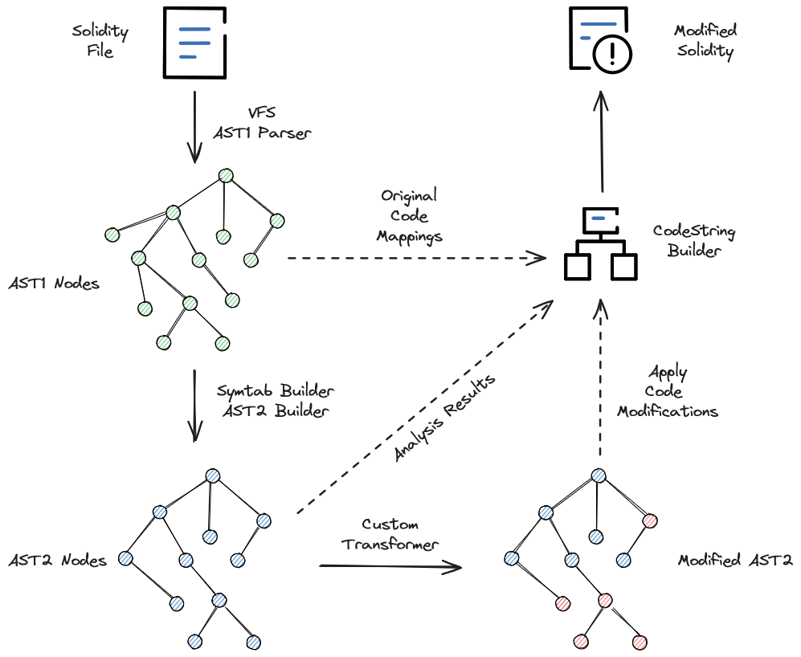

Working with Source Code
========================

SOLP lets you create powerful analyses for Solidity source code. This is enough for some tools; however, others need to
edit the source text or insert the results of the analysis in the code.

This document will lead you through building a tool that inserts comments above functions with analysis insights from
an AI depending on the user's criteria.

General Strategy
----------------

One important thing that has to be reiterated is that AST2 can contain nodes that weren't in the original source code.
Check out the :doc:`twoASTs` document for why this is.

This means you have to go through the AST1 nodes, as they are guaranteed to be from the source text, and use the tagged
source location info for modifications. You can still use AST2 for analyses, but you have to use AST1 nodes to write the
output.

   An overview of the strategy

Setup
-----

Create the basic SOLP client setup to read the source files. We have to set up the virtual file system using the project
as a whole, but we only want to modify the user-specified files.

.. code-block:: python

   from pathlib import Path
   from dataclasses import dataclass

   import re

   from solidity_parser import filesys
   from solidity_parser.ast import symtab, ast2builder, solnodes, solnodes2

   # this is user input
   files_to_annotate = ['TheContract.sol']
   project_dir = Path('./gptcomments')

   # setup VFS
   vfs = filesys.VirtualFileSystem(project_dir, None, [])
   sym_builder = symtab.Builder2(vfs)

This tutorial uses sample code as an example (generated by ChatGPT). The file is too large to list here, but check it out
from the ``examples/gptcomments`` directory (named TheContract.sol).

.. note:: This Solidity project doesn't have a source or contracts folder, so we don't pass anything in for ``include_paths``.
          The contracts get loaded from the ``base_path`` instead.

Comment Formatting
^^^^^^^^^^^^^^^^^^

We will need these formatting helpers later on. They are not specific to SOLP but make the output nicer:

.. code-block:: python

   INDENT_REG = re.compile(r'[ \t]+$')

   def get_trailing_whitespace(s) -> str:
       match = INDENT_REG.search(s)
       if match:
           return match.group(0)
       else:
           return ""

   LINE_REG = re.compile("\r?\n")

   def indent_by(s, indentation) -> str:
       return ("\n" + indentation).join(LINE_REG.split(s))

These will be used alongside this ``Insertion`` dataclass to mark which comments will go where:

.. code-block:: python

   @dataclass
   class Insertion:
       func: solnodes.FunctionDefinition
       comment: str

Annotation Skeleton
^^^^^^^^^^^^^^^^^^^

Now we just need to create a function that loads each file, finds the functions to annotate, and annotates them. We will
fill in the details as we go along:

.. code-block:: python
   :linenos:

   def should_annotate_part(part: solnodes.ContractPart):
       return True

   def annotate_func(func_src: str, func: solnodes.FunctionDefinition):
       return f'This is a test comment for: {func.name}'

   def annotate_file(file_name):
       file_sym_info = sym_builder.process_or_find_from_base_dir(file_name)

       loaded_src = vfs.sources[file_name]
       ast1_nodes, src_code = loaded_src.ast, loaded_src.contents

       for node in ast1_nodes:
           if not node:
               continue

           for func in node.get_all_children(lambda x: isinstance(x, solnodes.FunctionDefinition)):
               if should_annotate_part(func):
                   func_code = src_code[func.start_buffer_index:func.end_buffer_index]
                   comment_contents = annotate_func(func_code, func)
                   print(comment_contents)

Working With Source Buffers
"""""""""""""""""""""""""""

The ``annotate_func`` function is where we would put the call to an AI service(or static analysis) that takes the source code of the **function only**
and provides a summary.

Also, ``func_src`` is extracted from the :py:attr:`source text buffer <solidity_parser.filesys.LoadedSource.contents>` using
the :py:attr:`start <solidity_parser.ast.nodebase.Node.start_buffer_index>` and
:py:attr:`end <solidity_parser.ast.nodebase.Node.end_buffer_index>` character indexes for the function we're currently
annotating.

IDE Line Data
"""""""""""""

However, we can also get the corrected column information for the
:py:attr:`start <solidity_parser.ast.nodebase.Node.start_location>` and
:py:attr:`end <solidity_parser.ast.nodebase.Node.end_location>` of the node if we need to provide these insights to an
IDE language extension, for example.

Modifying the Source Text
-------------------------

Instead of printing the ``comment_contents`` on line 21, create an ``Insertion`` object and store it in a list.

.. code-block:: python

   insertions = [] # line 12
   ...
   insertions.append(Insertion(func, comment_contents)) # line 21

Text Insertions
^^^^^^^^^^^^^^^

Now create a function to do the text insertions and return the updated source code.

.. code-block:: python
   :linenos:

   def modify_text(src_code, insertions):
       reverse_sorted_insertions = sorted(insertions, key=lambda x: (-x.func.start_location.line, x.func.start_location.column))
       current_source_code = src_code

       for ins in reverse_sorted_insertions:
           func_text_offset = ins.func.start_buffer_index
           left, right = (current_source_code[0:func_text_offset], current_source_code[func_text_offset:])

           # for formatting the comments nicely
           whitespace = get_trailing_whitespace(left)
           formatted_comment = indent_by(f'// {ins.comment}', whitespace)
           current_source_code = left + formatted_comment + '\n' + whitespace + right

       return current_source_code

This code might look intimidating, but we'll go through it step by step:

* Line 1 simply reverse sorts the insertions based on the order of the functions in the original source code. If we did
  a top-down insertion instead, every insertion would mess up the insertion location of the subsequent ones.
* Lines 6–7 simply create a split in the text for us to put the function-summary comment. Since we're inserting comments
  before each function, we use the ``start_buffer_index`` — ``left`` then becomes all of the code in the file up to the ``function``
  keyword and right is everything that comes after. When we insert our comment after ``left`` but before ``right``, it
  puts our comment right above the function.
* Lines 10–11 put the comments on the same indentation level as the function to make it easier to read.
* Line 12 simply joins up all the parts and whitespace required, creating a complete source file's worth of code.
* Repeat this for all insertions, and we get fully commented code.

Putting It All Together
-----------------------

Now we just call ``modify_text`` from the end of ``annotate_file``,

.. code-block:: python

   print(modify_text(src_code, insertions))

and call ``annotate_file`` with each of our inputs:

.. code-block:: python

   for f in files_to_annotate:
       annotate_file(f)

And the basic text transformer is done!

Extending It Further
--------------------

There were a few features outside of the scope of this tutorial that would take this project to the next level. Try the
following ideas to get more familiar with the project and SOLP:

* Connect to a local or online text AI that can take the ``func_code`` and return a summary.
* Take user inputs for which functions to annotate and filter using ``should_annotate_part`` (e.g., only annotate ``public`` functions using :py:func:`modifiers checks <solidity_parser.ast.solnodes.has_modifier_kind>`).
* Generate AST2 for the program, and for each AST1 function, use the :py:attr:`AST2 node <solidity_parser.ast.solnodes.AST1Node.ast2_node>`
  to get more refined insights.