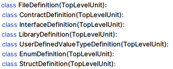

Two ASTs?
=========

.. tip:: SOLP currently has two forms of AST: AST1 and AST2. If you're wondering which one you should use, the short of it is AST2.

Preface
-------

Simply put, AST2 gives you a more consistent and easy to use set of nodes, but it has a couple of limitations:

* You need to load the full project into SOLP, which might not be possible (e.g., missing dependencies) or desirable (e.g., too large).
* It takes longer to create as it requires extra builder passes.
* In the unlikely case, the builder fails due to an unexpected error.
* It's not as closely linked to the original source code as AST1 (e.g., some synthetic nodes are generated that don't 
  have source location data linked to them).

If your specific project needs to be able to modify the exact source code, check out
:doc:`this guide <sourcecode>`, which provides tips on working on Solidity source-code transformers.

The rest of this document highlights some features specific to AST2 to show the reason why it exists and the ways in which
it's different to AST1.

TopLevelUnits vs SourceUnits
----------------------------

All nodes have a ``parent`` attribute, right? So let's say we have a function, modifier, event (etc.) definition, and we want to get the contract it
was declared in. We just take the parent and use it like it's a contract.

Hold on! There's a couple of assumptions there. Consider the following Solidity valid code:

.. code-block:: solidity
   :caption: FloatingFunc.sol

   pragma solidity ^0.8.0;

   error SafeCast__NegativeValue();

   library IntHelper {
       function toUint256(int256 value) internal pure returns (uint256) {
           if (value < 0) revert SafeCast__NegativeValue();
           return uint256(value);
       }
   }

There are two things to note here.

1. The Parent of ``toUint256`` Is a ``LibraryDefinition``
^^^^^^^^^^^^^^^^^^^^^^^^^^^^^^^^^^^^^^^^^^^^^^^^^^^^^^^^^

This point is solved by changing our mental model slightly. Does it really matter that the parent is a library or a contract?
Usually, not really. Instead, we generalize the parent of something like a function or a state variable to be a TopLevelUnit in AST2.
Without needing to know the specific definition type, we can

* get type information (:py:meth:`as_type() <solidity_parser.ast.solnodes2.TopLevelUnit.as_type>`)
* find contract parts/members (:py:meth:`find_named_parts() <solidity_parser.ast.solnodes2.TopLevelUnit.find_named_parts>`)
* check the inheritance hierarchy (:py:meth:`is_subttype_of() <solidity_parser.ast.solnodes2.TopLevelUnit.is_subttype_of>`, :py:meth:`get_supers() <solidity_parser.ast.solnodes2.TopLevelUnit.get_supers>`, :py:meth:`get_subtypes() <solidity_parser.ast.solnodes2.TopLevelUnit.get_subtypes>`)
* get common data (:py:meth:`descriptor() <solidity_parser.ast.solnodes2.TopLevelUnit.descriptor>`, :py:attr:`name <solidity_parser.ast.solnodes2.TopLevelUnit.name>`)

Look at the list of **TopLevelUnits**:

|toplevelunits|

These make sense. All of these Solidity types usually contain related parts all grouped together. Additionally, none of them
are marked as *ContractParts* (see below), meaning they can't be nested inside other TopLevelUnits; they are top-level nodes (parentless).

The equivalent in AST1 are **SourceUnits**, which are defined based on the allowable Solidity grammar rules.

|sourceunits|

Solidity allows free-floating definitions for functions and events as well as nesting (e.g., putting a library
inside of a contract). This makes traversing AST1 nodes more difficult as you don't have a guarantee that the SourceUnit
is a root node or if it is part of another SourceUnit.

2. FileDefinitions Can Contain ContractParts
^^^^^^^^^^^^^^^^^^^^^^^^^^^^^^^^^^^^^^^^^^^^

Ask the virtual file system to load and parse the file above. You'll get a list of source units:

.. code-block:: python

   PragmaDirective(name=Ident(text='solidity'), value='^0.8.0')
   ErrorDefinition(name=Ident(text='SafeCast__NegativeValue'), parameters=[])
   LibraryDefinition(name=Ident(text='IntHelper'), parts=[...])

See how ``SafeCast__NegativeValue`` acts as a SourceUnit rather than a pure ContractPart? That's because it was declared at the
top level of the file. As a result, the ``parent`` of ``SafeCast__NegativeValue`` is ``None``.

In AST2, a :py:class:`FileDefinition <solidity_parser.ast.solnodes2.FileDefinition>` is created as a kind of
psuedo-contract to hold free-floating contract parts like the error definition.

Compare the source units above to the output of :py:meth:`get_top_level_units() <solidity_parser.ast.ast2builder.Builder.get_top_level_units>`
from the AST2 builder:

.. code-block:: python

   FileDefinition(source_unit_name='FloatingFunc.sol', name=Ident(text='FloatingFunc.sol'), parts=[ErrorDefinition(name=Ident(text='SafeCast__NegativeValue'), inputs=[])])
   LibraryDefinition(source_unit_name='FloatingFunc.sol', name=Ident(text='IntHelper'), parts=[...])

The error can now be referenced like any other contract part — with a base (the file definition) and a name. For example,
in the AST2 ``function.code`` for ``toUint256``, the revert node is this:

.. code-block:: python

   RevertWithError(error=<REF(FloatingFunc.sol.SafeCast__NegativeValue)>, args=[])

Imports, Pragmas, Usings
------------------------

AST1 has a bunch of SourceUnit subclasses such as ``PragmaDirective``, ``ImportDirective``, and ``UsingDirective``. We don't see them in AST2; what's going on?

These constructs in Solidity require compiler support for the Solidity code to make sense. For example,

* Imports need to be resolved using path resolution rules.
* Pragmas influence the compiler version.
* Using statements change which members are available for a type in a given scope.

These are complicated details that aren't useful to most people who need to the use the AST; they just want to deal
with a simple AST interface that lets them easily navigate the Solidity code.

The AST2 builder handles these complications and embeds them into the AST2 nodes.

Consider the contracts:

.. code-block:: Solidity
   :linenos:

   // AdderLib.sol
   pragma solidity ^0.8.0;

   library Adder {
       function add(uint256 a, uint256 b) public pure returns (uint256) {
           return a + b;
       }
   }

   // MyContract.sol
   pragma solidity ^0.8.0;

   import "AdderLib.sol";

   contract MyContract {
       Adder private adder;
       uint256 public myVariable;

       function addToVariable(uint256 value) public {
           myVariable = adder.add(myVariable, value);
       }

       function notALibraryCall() public {
           addToVariable(50);
       }
   }

Import Resolution
^^^^^^^^^^^^^^^^^

The import on line 13 is removed in AST2. The ``LibraryDefinition`` generated from AdderLib.sol is directly referenced
on line 16 as a :py:class:`ResolvedUserType <solidity_parser.ast.solnodes2.ResolvedUserType>`, which, as the name suggests, is a :py:class:`Type <solidity_parser.ast.types.Type>`
containing a reference to the library definition. However, the AST1 :py:class:`UserType <solidity_parser.ast.types.UserType>` only knows the textual name of the type
used in the Solidity source code.

.. code-block:: python

   # AST1
   StateVariableDeclaration(name=Ident(text='adder'), var_type=UserType(name=Ident(text='Adder')), modifiers=[...])
   # AST2, Adder is a Ref[LibraryDefinition]
   StateVariableDeclaration(name=Ident(text='adder'), ttype=ResolvedUserType(Adder), modifiers=[...])

Using Directives
^^^^^^^^^^^^^^^^

In a similar vein, the library call on line 20 is made explicit in AST2. As shown by the ``code_str`` of the node below,
the previous 2-ary function call now takes takes the base as the first argument, matching the signature of ``add``
as defined in the library.

.. code-block:: Solidity

   Adder.add(this.adder, this.myVariable, value)

Final Words
-----------

This document aimed to clarify why SOLP are two forms of AST. They look similar, but there are important details that
make AST2 better for most developers.

There is a lot more you can do with SOLPs ASTs; there are other components and use cases of SOLP that will be documented
more in the future. In the meantime, check out the :py:mod:`API reference <solidity_parser.ast.solnodes2.py>` to see
what types are available.